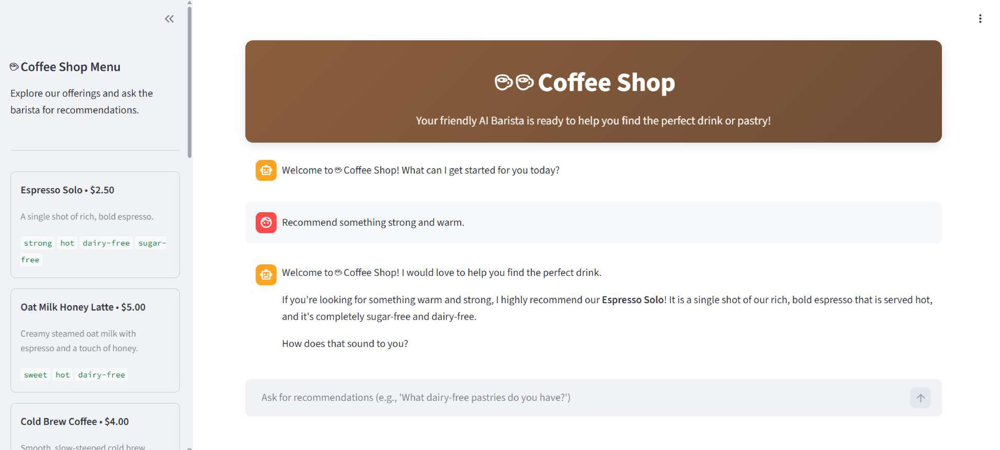
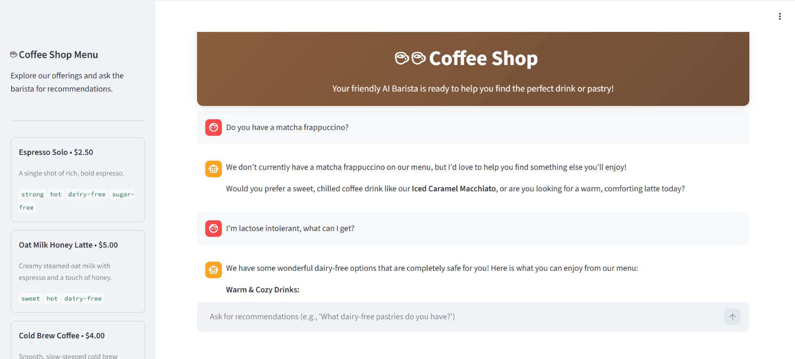
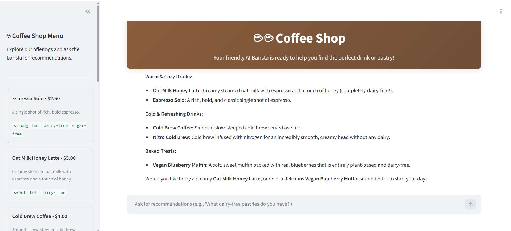

# ☕ Grounded AI Coffee Barista

An AI-powered coffee shop assistant that recommends drinks and pastries based only on the shop's actual menu.

The application combines Google's Agent Development Kit, Gemini, and Streamlit to provide grounded, menu-aware recommendations based on customer preferences such as taste, temperature, strength, dietary requirements, and allergens.

## 🚀 Project Overview

Customers often need help choosing an item from a menu. A general-purpose AI assistant may suggest products that a coffee shop does not actually sell or overlook important dietary restrictions.

This project solves that problem by connecting the AI barista to a structured menu. The agent retrieves menu information and uses it as the source for its recommendations.

The result is a friendly AI barista that provides useful menu-based suggestions while avoiding unsupported menu items.

## ✨ Key Features

- Recommends drinks and pastries from the actual coffee shop menu
- Uses menu data as the grounding source
- Supports preference-based recommendations
- Considers drink temperature, sweetness, strength, and category
- Considers dietary requirements such as dairy-free and vegan preferences
- Uses allergen information when making recommendations
- Asks a clarifying question when the customer's preference is unclear
- Provides a simple and interactive Streamlit chat interface
- Displays the complete menu in the sidebar
- Maintains the conversation during the current session

## 🧠 Grounded AI Behavior

The agent is instructed to follow these rules:

1. Recommend items only from the menu.
2. Do not invent or suggest products that are not listed.
3. Ask one friendly clarifying question when the customer's request is unclear.
4. Base recommendations on menu descriptions, tags, and allergen information.
5. Respect dietary preferences and restrictions.

For example, if a customer asks for a dairy-free drink, the agent can recommend suitable menu items such as:

- Espresso Solo
- Oat Milk Honey Latte
- Cold Brew Coffee
- Nitro Cold Brew

The agent uses the menu as the source of truth instead of freely generating unsupported recommendations.

## 📸 Screenshots

### 1. Coffee Shop Interface

The Streamlit interface displays the available menu items and provides an interactive chat experience with the AI barista.



### 2. Grounded Recommendation

When a customer asks for an unavailable item, the agent does not invent it. Instead, it explains that the item is not available and suggests suitable alternatives from the actual menu.



### 3. Dietary Preference Recommendation

The agent recommends a suitable menu item based on the customer's preferences, such as strength and temperature, while considering dietary requirements such as lactose intolerance and using the menu's dietary tags and allergen information.



## 🎯 Demonstrated Use Cases

### Menu-Grounded Recommendations

The agent recommends drinks and pastries based on the actual menu instead of generating unsupported products.

### Handling Unavailable Items

When asked about a matcha frappuccino, the agent correctly explains that it is not listed on the menu and suggests available alternatives.

### Dietary-Aware Suggestions

When asked about lactose intolerance, the agent identifies suitable dairy-free options using the menu's tags and allergen information.

> Customers should still verify ingredients and allergen information with the coffee shop before ordering.

## 🗂️ Menu Data

The menu is stored in `menu.json`.

Each menu item contains information such as:

- Name
- Price
- Description
- Tags
- Allergens

The current menu includes:

- Espresso Solo
- Oat Milk Honey Latte
- Cold Brew Coffee
- Seasonal Pumpkin Latte
- Classic Croissant
- Vegan Blueberry Muffin
- Nitro Cold Brew
- Iced Caramel Macchiato

## 🏗️ Architecture

```text
Customer
   |
   v
Streamlit Chat Interface
   |
   v
Google ADK Runner
   |
   v
AI Barista Agent
   |
   v
get_menu() Tool
   |
   v
menu.json
   |
   v
Grounded Recommendation
```

## 📁 Project Structure

```text
grounded-ai-barista-rag-agent/
│
├── screenshots/
│   ├── coffee-shop-interface.png.jpg
│   ├── grounded-recommendation.png.jpg
│   └── dietary-recommendation.png.jpg
│
├── agent.py
├── app.py
├── menu.json
├── requirements.txt
└── README.md
```

### File Descriptions

| File | Description |
|---|---|
| `agent.py` | Defines the AI barista agent and the menu retrieval tool |
| `app.py` | Provides the Streamlit interface and chat functionality |
| `menu.json` | Contains the structured coffee shop menu |
| `requirements.txt` | Lists the required Python dependencies |
| `README.md` | Contains the project documentation |

## 🛠️ Technologies Used

- Python
- Google Agent Development Kit
- Gemini
- Streamlit
- JSON
- Google Cloud Run

## ⚙️ How It Works

1. The customer enters a request in the Streamlit chat interface.
2. The AI barista receives the request.
3. The agent uses the `get_menu()` tool to retrieve the menu from `menu.json`.
4. The agent checks the available items, descriptions, tags, and allergens.
5. The agent recommends suitable items from the menu.
6. If the request is unclear, the agent asks one clarifying question.

## 💬 Example Prompts

```text
What dairy-free drinks do you have?
```

```text
I want something cold and strong.
```

```text
Do you have any vegan pastries?
```

```text
Do you have a matcha frappuccino?
```

```text
I'm lactose intolerant, what can I get?
```

```text
Recommend something strong and warm.
```

## ▶️ Running the Project Locally

### 1. Clone the repository

```bash
git clone https://github.com/codewithok/grounded-ai-barista-rag-agent.git
cd grounded-ai-barista-rag-agent
```

### 2. Install the dependencies

```bash
pip install -r requirements.txt
```

### 3. Configure the required Google/Gemini credentials

Set up the credentials required by your Google ADK environment.

### 4. Start the application

```bash
streamlit run app.py
```

The application will open in your browser.

## ☁️ Deployment

The application can be deployed as a web service using Google Cloud Run.

The deployed application uses:

- Streamlit for the user interface
- Google ADK for agent execution
- Gemini for natural-language responses
- `menu.json` as the menu data source

Deployment configuration and credentials depend on the selected Google Cloud environment.

## 🔮 Future Improvements

Possible future improvements include:

- Adding more menu items
- Connecting the menu to a database
- Adding order placement functionality
- Adding customer order history
- Adding multilingual support
- Adding voice-based interaction
- Adding automated tests
- Adding a dedicated deployment configuration

## 📌 Disclaimer

This project is intended for demonstration and learning purposes. Menu availability, prices, and recommendations depend on the contents of `menu.json`.

Dietary and allergen information should be verified with the coffee shop before ordering.

## 👤 Author

Created as an AI agent project using Google technologies.
